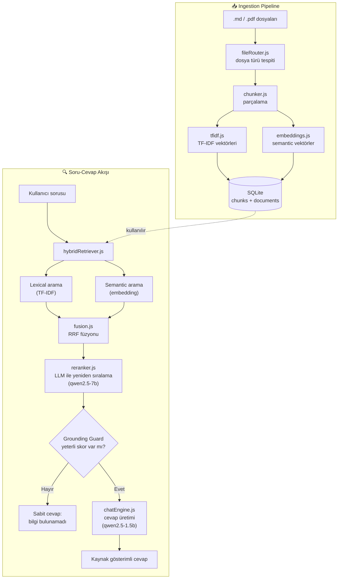

# 🛠️ Saha Destek Asistanı — Offline RAG Sistemi

Foundry Local ile tamamen **çevrimdışı** (internet gerektirmeden) çalışan, saha personeli için güvenlik ve bakım prosedürlerini yanıtlayan bir RAG (Retrieval-Augmented Generation) uygulaması. Microsoft'un ["Building Your First Local RAG Application with Foundry Local"](https://techcommunity.microsoft.com/blog/azuredevcommunityblog/building-your-first-local-rag-application-with-foundry-local/4501968) makalesinden yola çıkılarak, hybrid retrieval, LLM reranking, otomatik test paketi ve CI pipeline ile production seviyesine genişletilmiştir.


## Özellikler

- 🔒 **Tamamen offline** — hiçbir veri internete çıkmaz, Foundry Local ile yerel çıkarım (inference)
- 🔍 **Hybrid retrieval** — TF-IDF (lexical) + embedding (semantic) aramanın Reciprocal Rank Fusion ile birleşimi
- 🎯 **LLM reranking** — daha güçlü bir model (qwen2.5-7b) adayları karşılaştırmalı olarak yeniden sıralar
- 🛡️ **Grounding guard** — dokümanlarda yeterli bilgi yoksa model hiç çağrılmadan dürüst bir "bilgi bulunamadı" cevabı döner (halüsinasyon riski sıfır)
- 📄 **PDF + Markdown desteği** — her iki formatı da otomatik ayrıştırır ve indeksler
- 📤 **Canlı doküman yükleme** — tarayıcıdan dosya yükle, sistem otomatik yeniden indekslenir
- ✅ **40+ otomatik test** — saf mantık katmanı (chunking, TF-IDF, RRF, güvenlik doğrulaması) için, her `git push`'ta CI ile otomatik çalışır
- 📊 **Ölçülebilir kalite** — golden test seti ile retrieval ve içerik doğruluğu somut yüzdelerle ölçülür

## Mimari



**Neden iki farklı model?** Reranking (hangi bilginin alakalı olduğuna karar vermek) daha güçlü akıl yürütme gerektirir, bu yüzden `qwen2.5-7b` kullanılır. Cevap üretimi ise hız öncelikli olduğu için `qwen2.5-1.5b` ile yapılır. Bu ayrım, gerçek testlerle netleşti — küçük modeller tek başına relevance kararlarında tutarsız çıktı verdi.

## Kurulum

### Gereksinimler
- **Node.js 22.x LTS** (⚠️ Node 24 ile `foundry-local-sdk`'nin native DLL'i çakışıyor, mutlaka 22.x kullanın)
- [Foundry Local](https://github.com/microsoft/Foundry-Local) kurulu ve çalışır durumda

### Adımlar

```bash
git clone https://github.com/manolyablgn/gas-field-rag.git
cd gas-field-rag
npm install
cp .env.example .env
npm run ingest
npm start
```

Tarayıcıda `http://localhost:3000` adresine git.

## Testler

```bash
npm test
```

Saf mantık katmanını (model/Foundry Local gerektirmeyen kısımlar) kapsar: chunking, TF-IDF, RRF füzyonu, hata sınıfları, dosya yükleme güvenliği. Her `git push`'ta GitHub Actions ile otomatik çalışır.

## Proje Yapısı

```
src/
├── config.js              # Tüm ayarlar, .env'den okunur, başlangıçta doğrulanır
├── server.js               # Express sunucu
├── ingest.js                # Doküman indeksleme (CLI + yeniden kullanılabilir fonksiyon)
├── db/sqlite.js             # Veritabanı şeması
├── ingestion/
│   ├── chunker.js           # Markdown/PDF okuma + parçalama
│   ├── fileRouter.js        # Dosya türü tespiti
│   ├── pdfLoader.js         # PDF metin çıkarma
│   ├── tfidf.js              # Lexical vektörleştirme
│   ├── embeddings.js         # Semantic vektörleştirme
│   └── uploadValidation.js   # Yükleme güvenliği (path traversal koruması)
├── retrieval/
│   ├── hybridRetriever.js    # Ana retrieval orkestrasyon
│   ├── fusion.js              # RRF füzyon mantığı
│   └── reranker.js            # LLM tabanlı yeniden sıralama
├── generation/
│   ├── foundryClient.js      # Foundry Local SDK bağlantısı
│   ├── chatEngine.js          # Retrieval + generation orkestrasyon
│   └── prompts.js              # Sistem/kullanıcı promptları
└── utils/errors.js           # Özel hata sınıfları + retry mantığı

test/                        # 40+ otomatik test
.github/workflows/ci.yml     # CI pipeline
```

## Bilinen Sınırlar

Sistem, 30 soruluk bir golden test setinde **%86.2 doğruluk** (retrieval %89.7, içerik %86.2) elde etmiştir. Kalan sınırlar şunlardır:

- **Çok kısa sorgular** (1-3 kelime, örn. "KKE ne demek") retrieval kalitesinde düşüş yaşayabilir — TF-IDF ve embedding'in yeterli bağlam yakalayamaması nedeniyle. İdeal kullanım tam cümle sorularla.
- **Soru/emir kipi uyumsuzluğu**: Doküman bir kuralı emir kipinde yazıyorsa ("X yapılmamalıdır"), aynı kuralı soru kipinde soran paraphrase'ler ("X yapılabilir mi?") bazen yanlış chunk'ı öne çıkarabilir.
- **Belirsiz alt-sorular**: Dokümanın genel bir kuralı olup, o kuralın bir alt-parçasına özel soru sorulduğunda (örn. "filtre temizliği ne sıklıkla" — doküman sadece genel denetim sıklığı veriyor), sistem bazen dürüstçe "bilgi bulamadım" der.
- **Tek kullanıcılı, yerel kullanım için tasarlandı** — çoklu eşzamanlı kullanıcı/production ölçekleme için ek altyapı (queue, rate limiting) gerekir.
- Windows 11 + Node 22.23.1 LTS üzerinde geliştirildi ve test edildi.

Detaylı eval sonuçları `src/eval/results/` altında saklanır.

## Teşekkür

Mimari, Microsoft'un [Foundry Local RAG örneğinden](https://techcommunity.microsoft.com/blog/azuredevcommunityblog/building-your-first-local-rag-application-with-foundry-local/4501968) esinlenmiştir.